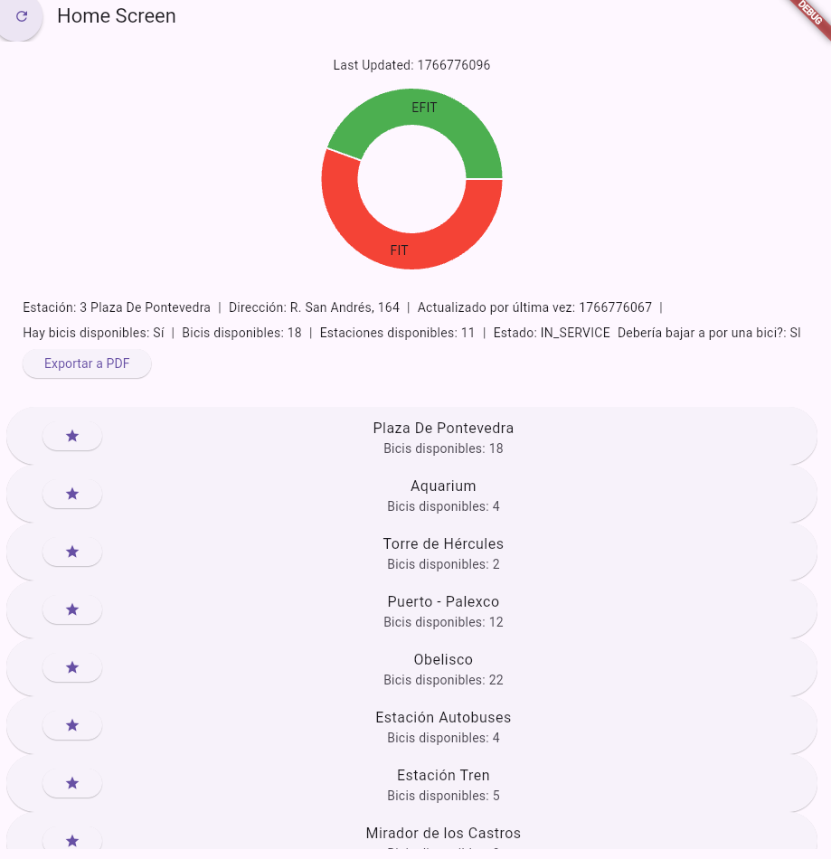

Esta aplicación pretende ofrecer de la manera más rápida a sus usuarios la información de la estación que elija, teniendo en un primer vistazo ocupando la mayor parte de la pantalla los datos a tiempo real de la misma. La gráfica principal de la estación refleja el porcentaje de los distintos tipos de bici que se encuentran disponibles, de modo que el detalle más importante de la estación queda disponible de un primer vistazo.

Además, permite actualizar pulsando el botón correspondiente arriba a la izquierda, acceder a un listado de todas las estaciones disponibles en la ciudad en una lista en la parte inferior de la pantalla y exportar la información en pdf.

Las dependencias usadas en el proyecto son: http, provider, fl_chart, pdf y printing.

